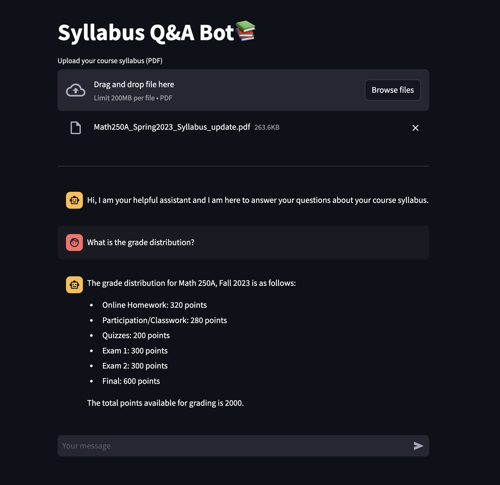

# Syllabus Q&A Bot 📚

Syllabus Q&A Bot is a Streamlit-based application that allows users to upload a course syllabus (PDF), ask questions about it, and receive answers based on document content and historical chat interactions.



## Features

- **Upload Syllabus:** Users can upload their course syllabus in PDF format.
- **Interactive Chat:** Users can ask questions related to the syllabus content.
- **AI Response:** Provides AI-generated answers based on the uploaded syllabus and conversation history.

## Installation

### Using Conda (recommended)

1. Clone this repository to your local machine.

   ```bash
   git clone https://github.com/Kaankocc/Syllabus-Q-A-ChatBot-Langchain-OpenAI.git
   cd Syllabus-Q-A-ChatBot-Langchain-OpenAI

   ```

2. Create a Conda environment from the environment.yml file.

   ```bash
   conda env create -f environment.yml

   ```

3. Activate the Conda environment.

   ```bash
   conda activate syllabus-bot

   ```

4. Set up your OpenAI API key

   - Obtain an API key from [OpenAI](https://www.openai.com).
   - Set the API key as an environment variable:
     ```bash
     export OPENAI_API_KEY="your-openai-api-key"
     ```

5. Run the application
   ```bash
   streamlit run app.py
   ```


